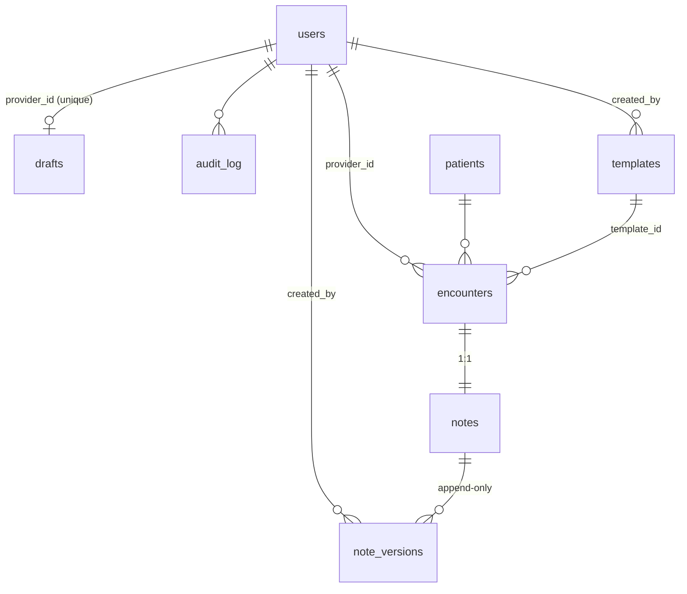

# PRD — Kyron Scribe: AI Clinical Documentation Platform

**Author:** Claude Fable 5 (architect/orchestrator) · **Builders:** Claude Opus 4.8 agents · **Integration & verification:** Fable 5 agents
**Date:** 2026-07-23 · **Source requirements:** [docs/CHALLENGE.md](docs/CHALLENGE.md)

---

## 1. Product overview

Kyron Scribe is a provider-facing AI clinical documentation platform. A physician pastes a raw encounter transcript (or types freeform observations), and the AI streams back a structured, professional SOAP note — Subjective, Objective, Assessment (with semantically matched ICD-10 codes), Plan — in real time. Notes are versioned immutably, drafts survive refreshes and device switches, returning patients get context-aware notes via backend tool calls, and admins manage the provider roster and the prompt-template library that shapes generation.

**North star:** a real physician would trust this with their clinical workflow. That means: dense, high-trust clinical UI; progressive streaming (never spinner-then-dump); zero data loss on edge cases; airtight auth; and infrastructure that survives scrutiny (RDS in a private subnet, Secrets Manager, nginx, pooling).

### 1.1 Users and roles

| Role | Capabilities |
|---|---|
| **Provider** | Own encounters only. Start encounter, generate note (streamed), edit inline, save, view/edit own history, version history + diff, ICD-10 search, drafts. |
| **Admin** | All encounters (filter by provider/date), provider roster (add/deactivate/reactivate), template library CRUD. No clinical editing of others' notes. |

### 1.2 Demo accounts (seeded, bcrypt-hashed)

| Email | Name | Role | Password |
|---|---|---|---|
| dr.chen@kyronhealth.demo | Dr. Sarah Chen, MD | provider | `KyronDemo2026!` |
| dr.patel@kyronhealth.demo | Dr. Raj Patel, DO | provider | `KyronDemo2026!` |
| dr.osei@kyronhealth.demo | Dr. Ama Osei, MD | provider | `KyronDemo2026!` |
| admin@kyronhealth.demo | Alex Morgan | admin | `KyronDemo2026!` |

Seed also creates returning patient **Margaret Chen, DOB 1955-03-12** with two completed prior encounters (hypertension follow-up; type 2 diabetes management) under Dr. Chen — so patient-history context injection is demoable immediately.

---

## 2. Scope

### 2.1 Core features (must be airtight)
- **F1 Auth & RBAC** — JWT (HS256) in httpOnly cookie; provider/admin roles; per-request active-account check; audit logging.
- **F2 Encounter workspace** — patient identity form, transcript textarea, template selector, Generate Note.
- **F3 Streaming generation** — SSE; progressive section-by-section render; structured output contract; editable result.
- **F4 Patient history context injection** — Anthropic **tool use**: model calls `get_patient_history`; server executes the DB query mid-generation and returns prior notes as a tool result. Never injected from the frontend.
- **F5 Immutable note versioning** — append-only `note_versions`; full history with author + timestamp.
- **F6 ICD-10 semantic search** — ≥300 embedded ICD-10-CM codes, local vector embeddings (MiniLM), cosine similarity; click-to-append to Assessment.
- **F7 Admin dashboard** — encounters (provider + date-range filters), roster management, template CRUD; template changes effective on next generation with no refresh (server loads template fresh from DB at generation time).
- **F8 Session persistence** — server-side draft autosave (debounced); restore on any device after refresh/re-login.
- **F9 Non-happy paths** (three implemented, two demoed):
  - **N1** No clinically meaningful content → model emits `<INSUFFICIENT>`; UI shows graceful guidance; no hallucinated note.
  - **N2** Session expires mid-save → 401 caught; note held in memory + localStorage; inline re-login modal; save retried automatically; zero loss.
  - **N3** Admin deactivates provider with open draft → next API call returns 403 `ACCOUNT_DEACTIVATED`; UI shows a calm lockout screen; draft preserved in DB for audit.

### 2.2 Pioneer features (differentiators)
- **P1 Clinical red-flag pre-scan** — the model emits `<RED_FLAGS>` before the SOAP sections; UI surfaces severity-tagged banner chips (e.g., chest pain + diaphoresis) before the note finishes.
- **P2 Version diff view** — word-level diff between any two versions (insertions green, deletions red struck-through), per SOAP section.
- **P3 Context transparency panel** — after generation, shows exactly which prior encounters the AI consulted (returning patient) or "first-time patient — no prior history" (differential behavior made visible).
- **P4 Print-ready note export** — print stylesheet renders a clean clinical document (browser print → PDF).
- **P5 Mock scribe mode** — `SCRIBE_MOCK=1` streams a realistic canned generation (with tool-call simulation) so the full UX is demoable without an API key. Clearly labeled in UI when active.

### 2.3 Non-goals
No patient portal, no real PHI/HIPAA compliance program (demo data only), no e-prescribing, no multi-tenant orgs, no email flows, no password reset (admin resets by recreating).

---

## 3. Architecture

```
Browser (React SPA)
   │ HTTPS
   ▼
nginx (EC2, ports 80/443; TLS via Let's Encrypt; serves client/dist; proxies /api)
   │ 127.0.0.1:4000  (proxy_buffering off for /api/generate → SSE)
   ▼
Node 20 + Express + TypeScript  (systemd unit `kyron-scribe`, non-root user)
   ├── pg.Pool (max 10) ──────────────► AWS RDS PostgreSQL (private subnets, SG allows EC2 SG only)
   ├── @anthropic-ai/sdk (streaming + tool use) ─► Anthropic API (claude-sonnet-5)
   ├── @xenova/transformers (MiniLM, in-process embeddings; no external API)
   └── AWS Secrets Manager (boot-time secret load via EC2 instance role)
```

### 3.1 Stack and rationale (defend these in the walkthrough)

| Layer | Choice | Why |
|---|---|---|
| Backend | Node 20, **Express 4 + TypeScript** | Boring, explainable, first-class SSE control (`res.write`), one process behind nginx; every auth/pool/stream layer is hand-visible for the code walkthrough. |
| DB | **PostgreSQL** (RDS prod / Homebrew local) | Relational fit (versions, roles, audit); JSONB where shape is fluid (icd codes on a version); same engine dev↔prod. |
| DB access | **`pg` Pool, raw parameterized SQL** | The challenge explicitly grades pooling and schema defense; no ORM hiding the queries. Pool max 10, idle 30s; single pool per process. |
| Auth | **JWT HS256 in httpOnly SameSite=Lax cookie**, bcryptjs cost 12 | Stateless verify + cookie transport (no XSS-readable storage); per-request `is_active` DB check enables instant deactivation (N3). |
| AI | **Anthropic `claude-sonnet-5`** (env-overridable to `claude-opus-4-8`) | Best streaming latency/quality/cost for interactive scribing; native tool-use streaming for F4. |
| ICD search | **Local MiniLM embeddings (all-MiniLM-L6-v2, 384-dim) + cosine in Node** | Semantic, deterministic, zero per-keystroke API cost/latency; at 300 codes an index is overkill — in-process cosine is ~microseconds. Fallback: ILIKE keyword match. |
| Frontend | **React 18 + Vite + TypeScript + Tailwind 3.4** | Fast, typed, static build served by nginx (no SSR runtime to babysit on EC2). |
| Streaming | **SSE over `fetch` + ReadableStream** (POST) | One-way stream fits generation exactly; survives proxies; simpler than WebSockets to secure/scale. |
| Infra | **Terraform** (VPC, EC2, RDS, SGs, IAM, Secrets Manager) + nginx + systemd + certbot | Reproducible, reviewable topology; matches every infra grading line. |

### 3.2 Repository layout & file ownership (parallel-safety contract)

Root: `/Users/shariquekhatri/Kyron Take Home`. Owners: **A1** backend core · **A2** ICD dataset · **A3** frontend foundation · **A4** backend domain · **A5** backend AI · **A7** provider UI · **A8** admin UI · **A9** infra · **A10** integration. *No agent edits a file owned by another agent. Files marked "stub → X" are created as 501/placeholder stubs by the foundation agent and fully replaced by X.*

```
PRD.md, docs/CHALLENGE.md                 [Fable]
docs/ERD.md                               [A1]   docs/DEPLOYMENT.md [A9]   docs/DEMO_SCRIPT.md + README.md [A10]
server/
  package.json tsconfig.json .env.example [A1]
  data/icd10_codes.json                   [A2]
  migrations/001_init.sql                 [A1]
  scripts/migrate.ts, seed.ts             [A1]  (seed embeds ICD via src/services/embeddings.ts)
  src/index.ts app.ts config.ts db.ts     [A1]  (app.ts mounts ALL routers up front; frozen after Wave 1)
  src/types.ts                            [A1]  (all shared domain types)
  src/middleware/{auth,errors}.ts         [A1]
  src/services/audit.ts                   [A1]
  src/routes/{health,auth}.ts             [A1]
  src/routes/{patients,encounters,notes,drafts,admin}.ts   [A1 stub → A4]
  src/routes/{generate,icd}.ts            [A1 stub → A5]
  src/services/ai/{prompts,scribe,parser,mock}.ts          [A5]
  src/services/embeddings.ts              [A5]
client/
  package.json vite/tailwind config index.html   [A3]
  src/{main.tsx,App.tsx,styles.css}       [A3]
  src/api/client.ts  src/auth/AuthContext.tsx  [A3]
  src/components/ui/*  (full kit)         [A3]
  src/pages/Login.tsx                     [A3]
  src/pages/provider/{Workspace,EncounterList,EncounterDetail}.tsx  [A3 stub → A7]
  src/components/workspace/*  src/api/generateStream.ts             [A7]
  src/pages/admin/{AdminEncounters,AdminProviders,AdminTemplates}.tsx [A3 stub → A8]
  src/components/admin/*                  [A8]
infra/
  terraform/*.tf  nginx/  systemd/  deploy.sh  [A9]
server/test/*.test.ts                     [A10]
```

---

## 4. Data model

Normalized to 3NF; JSONB only for genuinely list-shaped payloads attached to an immutable version row (ICD code list, red flags). All timestamps `timestamptz`. IDs are `uuid` (`gen_random_uuid()`), except append-heavy `audit_log` (bigserial).

### 4.1 DDL (migration `001_init.sql` — authoritative)

```sql
CREATE EXTENSION IF NOT EXISTS pgcrypto;
CREATE TYPE user_role AS ENUM ('provider','admin');

CREATE TABLE users (
  id             uuid PRIMARY KEY DEFAULT gen_random_uuid(),
  email          text NOT NULL UNIQUE,           -- stored lowercase; app normalizes
  password_hash  text NOT NULL,
  full_name      text NOT NULL,
  credentials    text,                            -- "MD", "DO"…
  role           user_role NOT NULL,
  is_active      boolean NOT NULL DEFAULT true,
  created_at     timestamptz NOT NULL DEFAULT now(),
  deactivated_at timestamptz
);

CREATE TABLE patients (
  id         uuid PRIMARY KEY DEFAULT gen_random_uuid(),
  first_name text NOT NULL,
  last_name  text NOT NULL,
  dob        date NOT NULL,
  created_at timestamptz NOT NULL DEFAULT now()
);
CREATE UNIQUE INDEX patients_identity_uidx ON patients (lower(first_name), lower(last_name), dob);

CREATE TABLE templates (
  id          uuid PRIMARY KEY DEFAULT gen_random_uuid(),
  name        text NOT NULL,
  description text,
  prompt      text NOT NULL,                      -- structured instructions appended to system prompt
  is_deleted  boolean NOT NULL DEFAULT false,     -- soft delete: encounters reference templates
  created_by  uuid REFERENCES users(id),
  created_at  timestamptz NOT NULL DEFAULT now(),
  updated_at  timestamptz NOT NULL DEFAULT now()
);

CREATE TABLE encounters (
  id          uuid PRIMARY KEY DEFAULT gen_random_uuid(),
  patient_id  uuid NOT NULL REFERENCES patients(id),
  provider_id uuid NOT NULL REFERENCES users(id),
  template_id uuid REFERENCES templates(id),
  transcript  text NOT NULL,
  created_at  timestamptz NOT NULL DEFAULT now(),
  updated_at  timestamptz NOT NULL DEFAULT now()
);
CREATE INDEX encounters_provider_created_idx ON encounters (provider_id, created_at DESC); -- provider list + admin provider filter
CREATE INDEX encounters_patient_idx  ON encounters (patient_id);                            -- history retrieval tool
CREATE INDEX encounters_created_idx  ON encounters (created_at DESC);                       -- admin date-range filter

CREATE TABLE notes (            -- 1:1 with encounter; anchor for the version chain
  id           uuid PRIMARY KEY DEFAULT gen_random_uuid(),
  encounter_id uuid NOT NULL UNIQUE REFERENCES encounters(id),
  created_at   timestamptz NOT NULL DEFAULT now()
);

CREATE TABLE note_versions (    -- append-only; NEVER updated or deleted
  id          uuid PRIMARY KEY DEFAULT gen_random_uuid(),
  note_id     uuid NOT NULL REFERENCES notes(id),
  version_no  integer NOT NULL,
  subjective  text NOT NULL DEFAULT '',
  objective   text NOT NULL DEFAULT '',
  assessment  text NOT NULL DEFAULT '',
  plan        text NOT NULL DEFAULT '',
  icd_codes   jsonb NOT NULL DEFAULT '[]',        -- [{code, description}]
  red_flags   jsonb NOT NULL DEFAULT '[]',        -- [{severity, text}]
  created_by  uuid NOT NULL REFERENCES users(id),
  created_at  timestamptz NOT NULL DEFAULT now(),
  UNIQUE (note_id, version_no)                    -- race-safe monotonic versions
);
CREATE INDEX note_versions_note_idx ON note_versions (note_id, version_no DESC);

CREATE TABLE drafts (           -- one in-flight encounter per provider (cross-device restore)
  id            uuid PRIMARY KEY DEFAULT gen_random_uuid(),
  provider_id   uuid NOT NULL UNIQUE REFERENCES users(id),
  patient_first text NOT NULL DEFAULT '',
  patient_last  text NOT NULL DEFAULT '',
  patient_dob   date,
  template_id   uuid REFERENCES templates(id),
  transcript    text NOT NULL DEFAULT '',
  note_json     jsonb,                            -- generated-but-unsaved note incl. inline edits
  updated_at    timestamptz NOT NULL DEFAULT now()
);

CREATE TABLE icd10_codes (
  code        text PRIMARY KEY,                   -- e.g. 'M54.50'
  description text NOT NULL,
  category    text,
  embedding   jsonb                               -- 384-dim MiniLM vector; null until seed embeds
);

CREATE TABLE audit_log (
  id          bigserial PRIMARY KEY,
  user_id     uuid REFERENCES users(id),
  action      text NOT NULL,                      -- login, note.save, template.update, provider.deactivate, generate…
  entity_type text,
  entity_id   text,
  meta        jsonb NOT NULL DEFAULT '{}',
  created_at  timestamptz NOT NULL DEFAULT now()
);
CREATE INDEX audit_log_created_idx ON audit_log (created_at DESC);
CREATE INDEX audit_log_user_idx    ON audit_log (user_id, created_at DESC);
```

### 4.2 ERD (mermaid — reproduce in docs/ERD.md with commentary)



**Defensibility talking points:** `notes` exists (vs. hanging versions off `encounters`) so the version chain has a stable anchor and `encounters` stays about the visit event; `UNIQUE(note_id, version_no)` makes concurrent saves race-safe (insert next = max+1, retry on conflict); drafts are a separate table (mutable, per-provider singleton) so the immutable clinical record never mixes with scratch state; ICD list lives as JSONB *on the version* because codes are part of the signed historical artifact, while `icd10_codes` is the normalized search catalog; every index maps to a named query path (comments above).

---

## 5. API specification

Base `/api`. JSON unless noted. Auth = `kyron_session` httpOnly cookie. Errors: `{ error: { code, message } }` — codes: `SESSION_EXPIRED` (401), `ACCOUNT_DEACTIVATED` (403), `FORBIDDEN` (403), `NOT_FOUND`, `VALIDATION` (400), `RATE_LIMITED` (429), `INTERNAL` (500). All inputs validated with zod.

| Method & path | Auth | Purpose / notes |
|---|---|---|
| POST `/auth/login` `{email,password}` | — | bcrypt verify → `is_active` check → JWT cookie (TTL `JWT_TTL_HOURS`, default 12) → `{user}`. Rate-limited 20/15min/IP. Audit `login`. |
| POST `/auth/logout` | any | Clear cookie. |
| GET `/auth/me` | any | `{user}` — SPA boot; also the deactivation tripwire. |
| GET `/patients/lookup?first&last&dob` | provider | `{exists, patientId?, encounterCount, lastSeen?}` — powers the "Returning patient" badge. |
| GET `/templates` | any | Active (non-deleted) templates for the selector. |
| GET `/encounters` | provider | Own encounters + patient + latest-version summary. |
| GET `/encounters/:id` | provider/admin | Owner or admin only. Encounter + patient + all versions (desc). |
| POST `/encounters` | provider | Finalize new encounter. TX: upsert patient (identity triple) → insert encounter, note, version 1 → delete caller's draft → audit `note.save`. Body: `{patient:{first,last,dob}, templateId, transcript, note:{subjective,objective,assessment,plan,icdCodes,redFlags}}`. |
| POST `/encounters/:id/versions` | provider (owner) | Append next version (max+1, retry once on unique conflict). Audit `note.save`. |
| GET `/drafts/current` | provider | Caller's draft or `null`. |
| PUT `/drafts/current` | provider | Upsert draft (autosave). Returns `{updatedAt}`. |
| DELETE `/drafts/current` | provider | Discard. |
| GET `/icd/search?q=` | any | Top 8 `{code, description, score}` — MiniLM cosine; ILIKE fallback. |
| POST `/generate` | provider | **SSE stream** (§6). Body: `{patient:{first,last,dob}, transcript, templateId}`. |
| GET `/admin/encounters?providerId&from&to` | admin | All encounters, joined provider + patient, filterable. |
| GET `/admin/providers` | admin | Roster + encounter counts + status. |
| POST `/admin/providers` `{email,fullName,credentials,password}` | admin | Create provider. Audit. |
| PATCH `/admin/providers/:id` `{isActive}` | admin | Deactivate/reactivate (sets `deactivated_at`). Audit `provider.deactivate`. Cannot deactivate self/admins. |
| GET `/admin/templates` · POST · PUT `/:id` · DELETE `/:id` | admin | CRUD; DELETE = soft delete. Audit `template.*`. **No cache anywhere** — generation reads the template row at request time, which is what makes admin edits take effect on the provider's very next generation with zero refresh. |
| GET `/health` | — | `{ok, db: pool ping}` for nginx/systemd checks. |

**Auth middleware chain (every protected route):** parse cookie → verify JWT (HS256, secret from Secrets Manager) → `SELECT is_active FROM users WHERE id=$1` → expired/invalid ⇒ 401 `SESSION_EXPIRED`; `is_active=false` ⇒ 403 `ACCOUNT_DEACTIVATED`; attach `req.user`. `requireAdmin` layered after. The per-request activity check is a deliberate trade (1 indexed PK lookup) to make deactivation instant — that's scenario N3.

---

## 6. AI pipeline (the flagship)

### 6.1 Generation flow (`POST /api/generate`)

1. Validate transcript non-empty; load **template fresh from DB**; look up patient by identity triple (id only — content retrieval is the model's job).
2. Open SSE (`Content-Type: text/event-stream`, `X-Accel-Buffering: no`, flush headers, 15s heartbeat comments).
3. `anthropic.messages.stream` — model `SCRIBE_MODEL` (default `claude-sonnet-5`), max_tokens 3000, system prompt = base scribe rules + active template prompt + patient banner (name/DOB/today) + **whether patient id exists** (not the history itself).
4. Tools: `get_patient_history{patient_id}` — *"Returns the patient's prior encounter notes from the clinical database. ALWAYS call this before writing the note when a patient_id is provided."* On `tool_use`: emit `status` event ("Reviewing N prior encounters…"), run one indexed query (last 5 versions: date, provider, S/O/A/P truncated to ~1200 chars each, ICD codes), return as `tool_result`, continue the stream. First-time patients: no tool offered + system prompt says "first visit — no history exists" (differential behavior is structural, not vibes).
5. Forward text deltas as SSE `delta` events. On completion, server-side parse (§6.2) → emit `complete` (structured JSON) or `insufficient` → `done`. Audit `generate`.
6. Client abort (`AbortController`) → cancel Anthropic stream; SSE write failure → cleanup. Anthropic error → SSE `error` event (UI keeps transcript intact).

### 6.2 Output contract (streamed tags → progressive UI)

Model is instructed to emit exactly:

```
<RED_FLAGS>[{"severity":"high","text":"…"}]</RED_FLAGS>
<SUBJECTIVE>…</SUBJECTIVE>
<OBJECTIVE>…</OBJECTIVE>
<ASSESSMENT>…</ASSESSMENT>
<CODES>[{"code":"I10","description":"Essential (primary) hypertension"}]</CODES>
<PLAN>…</PLAN>
```

or, when the transcript has no clinical content, **only**: `<INSUFFICIENT>brief professional reason</INSUFFICIENT>`.

Client parses tags incrementally: each section card fills token-by-token the moment its tag opens (satisfies "progressively renders" *visibly*). Server re-parses the full text authoritatively for `complete`. Objective section rule: if the transcript contains no objective findings, the model writes "Not documented during this encounter." — never invents vitals. `<CODES>` must contain ≥1 entry drawn from clinical content (grading requirement); prompt lists no codes — the model proposes, the provider verifies (and can add via the ICD widget).

### 6.3 SSE event protocol

`status {message}` · `red_flags {flags:[…]}` · `delta {text}` · `history {count, encounters:[{date, provider, codes}]}` (fuels P3 transparency panel) · `insufficient {reason}` · `complete {note}` · `error {message}` · `done {}`.

### 6.4 Prompt architecture (walkthrough-ready)

- **Base system prompt (`prompts.ts`):** role ("expert clinical scribe at Kyron Medical"), fidelity rules (document only what's in the transcript; no invented findings/vitals/meds; professional clinical register; standard abbreviations), section semantics, the tag contract, ICD-10 selection guidance (most specific code supported by the text), red-flag criteria (life/limb/time-critical symptoms), the INSUFFICIENT rule, and history-integration guidance ("reference relevant prior diagnoses/treatments where clinically appropriate, e.g. 'BP improved from 152/94 at last visit'").
- **Template prompt (DB, admin-editable):** appended under "ENCOUNTER TYPE INSTRUCTIONS". Seeded four, deliberately divergent so template switching is *visibly* different: **General SOAP** (balanced default) · **Orthopedic Follow-up** (MSK exam emphasis: ROM, strength, gait, imaging review, structured Objective) · **New Patient Evaluation** (comprehensive: full ROS summary, PMH/PSH/FamHx/SocHx in Subjective, broader differential in Assessment) · **Urgent Care Visit** (concise, disposition-first Plan, explicit return precautions).
- **Why claude-sonnet-5:** interactive streaming product → first-token latency and tokens/sec dominate perceived quality; sonnet-5 clinical summarization quality is excellent at a fraction of Opus cost; `SCRIBE_MODEL` env flips to `claude-opus-4-8` in one line if grading favors maximum depth.

### 6.5 ICD-10 semantic search

`server/data/icd10_codes.json`: ~320 curated ICD-10-CM entries across major systems (cardio, resp, GI, MSK, endo, neuro, psych, derm, GU, OB, injuries, symptoms/R-codes, Z-codes). Seed script embeds `"{code} {description}"` with all-MiniLM-L6-v2 (via @xenova/transformers, runs in-process, downloads once to `~/.cache`), stores vectors in `icd10_codes.embedding`. At boot the server warms the pipeline and loads all vectors into memory (~300×384 floats ≈ 460KB). Search: embed query → cosine → top 8 with scores. No external ICD API; no per-keystroke LLM cost. Fallback: ILIKE if the model can't load.

---

## 7. Frontend spec

### 7.1 Design system — "clinical, dense, high-trust"

- **Palette:** page `#F6F7F9`; surfaces white; ink `#0F172A`; muted `#5B6472`; borders `#E2E8F0`; primary `#1D4FD7` (deep clinical blue); success `#0E7C6B`; warning `#B45309`; critical `#B91C1C`; red-flag banner bg `#FEF2F2`. No gradients, no rounded-blob illustrations, nothing bubbly.
- **Type:** Inter (Google Fonts) + system fallback; body 13.5px/1.45; meta 12px; section titles 11px uppercase tracked; page titles 18px semibold. Tabular numerals for dates/times.
- **Density:** 8px grid; compact tables (36px rows); cards = 1px border + `0 1px 2px rgba(15,23,42,.05)`; radius 6px.
- **App shell:** slim top bar (wordmark "Kyron **Scribe**", environment chip, user menu w/ role badge); left rail nav (Provider: New Encounter, My Encounters · Admin: Encounters, Providers, Templates); content max-width 1200px.
- **Component kit (A3):** Button (primary/secondary/ghost/danger, sm/md), Input, Select, Textarea, DateInput, Card, Badge, Table, Modal, Toast system, Tabs, Spinner, EmptyState, PageHeader, Banner, SectionLabel.

### 7.2 Provider workspace (`/`) — the money screen

Two-column: **left** = encounter setup (patient first/last/DOB with returning-patient badge via lookup; template Select; transcript Textarea ~14 rows, monospace-ish; Generate button with streaming state; autosave indicator "Draft saved · just now"); **right** = the note. Before generation: EmptyState. During: status line ("Reviewing 2 prior encounters…"), red-flag banner chips as they arrive, then S/O/A/P cards filling token-by-token with a caret shimmer. After `complete`: sections become editable (borderless textareas that autosize; hover reveals edit affordance), ICD code chips (removable) under Assessment, context transparency panel (P3), then **Save Note** (primary) / Discard. ICD-10 search widget docked below the note (or right rail): search input, top-8 results with code / description / match %, click appends to Assessment codes. `insufficient` → amber Banner ("No clinically meaningful content identified… The transcript was preserved."), transcript untouched. Session-expiry (N2): re-login Modal in place, then auto-retry. Deactivation (N3): full-screen calm lockout ("Your account has been deactivated. Your draft has been preserved. Contact your administrator.").

### 7.3 Other screens

- **My Encounters:** dense table (Date · Patient · DOB · Template · Codes · Versions) → detail. **Detail:** read view of latest version; Edit → inline editing → "Save as new version"; version rail (v3 · Dr. Chen · Jul 23, 2:14 PM); **Diff view** (P2) between any two versions, word-level, per section; Print (P4).
- **Login:** centered card, wordmark, demo-account hint table (it's a take-home), error states.
- **Admin — Encounters:** filter bar (provider Select, date range) + table, row → read-only note view. **Providers:** roster table (name, email, status Badge, encounters, added) + "Add provider" Modal + Deactivate/Reactivate with confirm. **Templates:** list + editor (name, description, prompt textarea w/ mono font, char count); "changes apply to the provider's next generation immediately" helper text.

### 7.4 Client data/auth plumbing (A3)

`api/client.ts`: typed `api.get/post/put/del`, credentials included, throws `ApiError{status,code,message}`; a subscribable event bus emits `session-expired` (401) and `account-deactivated` (403). `AuthContext`: user state, login/logout, boot `GET /auth/me`, renders ReLoginModal on `session-expired` **and re-runs the failed action via a retry queue** (N2's zero-data-loss mechanism); deactivation event → lockout screen. Draft autosave hook `useDraftAutosave` (800ms debounce, dirty-tracking, localStorage mirror as belt-and-suspenders for N2).

---

## 8. Infrastructure (A9) — every graded line

- **Terraform** (`infra/terraform/`): VPC 10.0.0.0/16 · 1 public subnet (EC2) + 2 private subnets across AZs (RDS subnet group) · IGW + public route table · **EC2** t3.small, Ubuntu 22.04, Elastic IP, SG: 80/443 from 0.0.0.0/0, 22 from `var.admin_cidr` only · **RDS** PostgreSQL 16 `db.t4g.micro`, `publicly_accessible=false`, SG ingress 5432 **only from the EC2 SG** (SG-to-SG rule — the demo proof), storage encrypted, 7-day backups · **Secrets Manager** secret `kyron-scribe/prod` `{DATABASE_URL, JWT_SECRET, ANTHROPIC_API_KEY}` · **IAM instance role** granting `secretsmanager:GetSecretValue` on that one ARN only. Outputs: EIP, RDS endpoint, secret ARN. Variables: `admin_cidr`, `domain`, `db_password` (or random_password).
- **Config loading (`server/src/config.ts`, A1):** if `AWS_SECRETS_NAME` set → fetch via SDK (instance role; no static AWS keys on the box), merge over env; else dotenv (local dev only; `.env` gitignored; `.env.example` committed with placeholders only). **Zero credentials in the repo — enforced by verification agents.**
- **nginx:** serves `client/dist`; `location /api` → `proxy_pass http://127.0.0.1:4000`; `location /api/generate` adds `proxy_buffering off; proxy_cache off; proxy_read_timeout 300s;` (SSE); HTTP→HTTPS redirect; TLS via certbot/Let's Encrypt (real cert — requires a domain, see Open Needs); security headers (HSTS, nosniff, frame-deny).
- **systemd** `kyron-scribe.service`: non-root user, `Restart=always`, env `AWS_SECRETS_NAME`, `WantedBy=multi-user.target`. Node listens on 127.0.0.1:4000 only — never exposed.
- **deploy.sh** + `docs/DEPLOYMENT.md`: rsync/pull → `npm ci && build` (server+client) → migrate+seed (first run) → restart unit; full runbook from `terraform apply` to green padlock, including the "RDS is private" demonstration commands (`nc -w2 RDS_HOST 5432` fails from laptop, succeeds from EC2).

---

## 9. Security posture

httpOnly+SameSite=Lax cookie (no token in JS-readable storage); bcrypt(12); parameterized SQL everywhere (zero string-built queries — verified); zod on every input; role checks server-side on every route (ownership: `WHERE provider_id = req.user.id`, admin bypass explicit); login rate-limit; helmet-style headers at nginx; audit log on auth/clinical/admin mutations; secrets only via Secrets Manager/env; RDS reachable only intra-VPC; least-privilege IAM (one secret ARN); demo data only — no real PHI.

---

## 10. Agent execution plan (orchestration by Fable 5)

**Model policy:** builders = **Opus 4.8, high effort** (user directive); foundation/integration/verification = **Fable 5** where correctness compounds (A1 contracts, A10 integration, V-fleet verdicts). Every builder: reads this PRD first (its sections are the spec), owns ONLY its files (§3.2), runs `npx tsc --noEmit` (server) / `npm run build` (client) before returning, never commits git, never starts long-running servers (integration does runtime), returns structured JSON {summary, files, deviations, integrationNotes}.

### Wave 1 — Foundation (parallel: A1, A2, A3)
- **A1 · Backend core** *(Fable-spec critical: runs first-class)* — `server/` scaffold per §3.2: package.json (deps pinned §3.1: express4, pg8, jsonwebtoken9, bcryptjs, zod, cookie-parser, express-rate-limit, dotenv, @aws-sdk/client-secrets-manager, @anthropic-ai/sdk, @xenova/transformers, tsx, typescript), tsconfig (NodeNext, strict), `001_init.sql` **exactly §4.1**, migrate/seed scripts (seed: §1.2 users, §6.4 four templates with real divergent prompts, Margaret Chen + 2 realistic prior encounters/notes/version-1s, ICD embed step calling `embedAll()` from A5's module — code against the documented interface, works once A5 lands; seed must be idempotent/upsert), config.ts (Secrets Manager|dotenv per §8), db.ts (Pool max 10 + typed `query` helper + graceful shutdown), auth middleware + routes per §5 exactly (error codes matter: N2/N3 depend on them), audit service, errors middleware, health, app.ts mounting ALL routers (stubs 501 for A4/A5 files), types.ts (all domain types), .env.example, docs/ERD.md (§4.2 + commentary). **Accept:** tsc clean; `migrate && seed --skip-embeddings && dev` boots against local PG; login works via curl.
- **A2 · ICD-10 dataset** — `server/data/icd10_codes.json`: 300–340 real, accurate ICD-10-CM entries `{code, description, category}`, breadth per §6.5, includes codes matching seeded demo content (I10, E11.9, E78.5, M54.5x, J06.9, R07.9, N39.0, F41.1…). Billable-level specificity where standard. **Accept:** valid JSON, ≥300 unique valid-format codes, descriptions match official ICD-10-CM phrasing.
- **A3 · Frontend foundation** — `client/` scaffold: Vite+React18+TS+Tailwind 3.4 configured with §7.1 tokens; Inter; full UI kit; AppShell + role-aware routing (react-router 6; guards; admin lands `/admin`); AuthContext + api/client.ts + event bus + ReLoginModal + lockout screen per §7.4; Login page complete; provider/admin pages as coherent stubs. **Accept:** `npm run build` clean; kit components look §7.1 (dense, clinical), not default-Tailwind-bubbly.

### Wave 2 — Features (parallel: A4, A5, A7, A8, A9)
- **A4 · Backend domain routes** — replace stubs: patients, encounters (TX + patient upsert + version race handling), notes, drafts, admin per §5, §4 exactly; ownership checks; audit calls; zod schemas. **Accept:** tsc clean; every §5 route implemented incl. error codes.
- **A5 · Backend AI** — `services/ai/*`, `embeddings.ts`, replace generate.ts + icd.ts stubs: full §6 (SSE plumbing w/ heartbeats + abort; tool-use streaming loop; prompts.ts per §6.4; parser.ts robust to malformed tags; mock.ts realistic keyless demo incl. simulated tool call + red flags, ~40ms/chunk; embeddings module with `embedAll`, `embedQuery`, in-memory vector cache, cosine, ILIKE fallback). **Accept:** tsc clean; `SCRIBE_MOCK=1` streams a full well-formed generation through the real SSE path.
- **A7 · Provider UI** — Workspace/EncounterList/EncounterDetail + workspace components + `generateStream.ts` (fetch+ReadableStream SSE parser → typed events): §7.2–7.3 fully — progressive tag-parsing render, red-flag chips, transparency panel, inline editing, ICD widget, draft autosave hook + restore toast, save/version flows, diff view (`diff` pkg, word-level), print stylesheet, N1/N2/N3 UX. **Accept:** build clean; streaming render is genuinely incremental (no buffer-then-show).
- **A8 · Admin UI** — three admin pages + components per §7.3: filterable encounters (+ read-only note view), roster w/ add/deactivate modals, template editor w/ live-effect helper text. **Accept:** build clean; filters composable (provider AND date range).
- **A9 · Infra** — `infra/` + docs/DEPLOYMENT.md per §8 exactly: terraform (fmt/validate clean), nginx conf (SSE location block), systemd unit, deploy.sh, runbook incl. RDS-privacy demo + cert issuance + secret creation CLI. **Accept:** `terraform validate` passes (init -backend=false); no placeholder secrets anywhere.

### Wave 3 — Integration (A10, Fable, sequential)
Create local DB `kyron_scribe` (Homebrew PG); install/migrate/seed (with embeddings); boot server + client; **exercise every §5 endpoint via curl as provider AND admin** (auth, RBAC denial matrix, drafts, versions, template CRUD, ICD search relevance, SSE via `SCRIBE_MOCK=1` and via real key if present); fix every seam found (integration owns cross-cutting fixes anywhere); minimal vitest+supertest suite (auth, RBAC, version append-only, draft roundtrip); write README.md + docs/DEMO_SCRIPT.md (walkthrough script hitting every graded criterion + both non-happy-path demos). **Accept:** clean boot from `git clone` equivalent; all curl checks pass; tests green.

### Wave 4 — Verification fleet (parallel finders → adversarial verify → fixers → re-verify)
- **V1 Requirements coverage** (Fable): line-by-line docs/CHALLENGE.md audit → verdict + file:line evidence per requirement.
- **V2 Security** (Fable): auth chain, RBAC matrix, SQL param discipline, secret leakage grep, cookie flags, rate limits.
- **V3 Streaming/UX** (Opus): SSE correctness (heartbeats, abort, nginx compat), progressive render truthfulness, error-state UX, design-system fidelity (§7.1).
- **V4 Infra** (Opus): §8 vs terraform/nginx/systemd reality; pooling; secrets path; RDS privacy.
- Findings → adversarial verification (independent refuter per finding) → confirmed issues fixed by targeted Opus fixers → re-verify. Loop until no confirmed HIGH/MED issues.

### Wave 5 — Final QA (Fable, me)
Boot the app, drive it in the browser (login → returning-patient encounter → mock-stream generation → edit → save → version → diff → admin flows → N1/N2 demos), screenshot-verify UI quality, final report to Sharique with the credentials/open-needs list.

---

## 11. Acceptance checklist (maps 1:1 to grading)

☐ Login: 4 seeded accounts, JWT cookie, layered middleware explainable • ☐ Provider isolation (cross-provider 403 proven) • ☐ Streaming SOAP: progressive SSE render, S/O/A/P + ≥1 semantically matched ICD code • ☐ Inline edit → save → RDS-backed • ☐ History via backend tool call; visible returning-vs-new behavioral difference • ☐ Append-only versions w/ author+time; history UI; diff • ☐ ICD widget: plain-English → top-8 semantic, click-to-append, ≥300 embedded codes, no external API • ☐ Admin: filterable encounters, roster add/deactivate, template CRUD, next-generation template effect w/o refresh • ☐ Draft restore across refresh/devices from DB • ☐ N1 + N2 (+N3) implemented & scripted in demo doc • ☐ Infra: EC2+nginx+HTTPS(real cert), private RDS, Secrets Manager, pooling, normalized ERD • ☐ Pioneer: red flags, diff view, transparency panel, print export • ☐ README + DEMO_SCRIPT + DEPLOYMENT docs.

## 12. Open needs (from Sharique)

1. **Anthropic API key** — for live generation (mock mode covers UX until then). Goes into `.env` locally / Secrets Manager in prod. Never committed.
2. **AWS go-ahead** — creds are already configured (acct 872180501519, us-east-2). Terraform will create billable resources (~$25–30/mo: t3.small + db.t4g.micro + EIP). I will not `apply` without your explicit OK.
3. **A domain or subdomain** — required for a non-self-signed cert (Let's Encrypt). Any registrar; a subdomain A-record → the Elastic IP is enough. (No domain? Cheapest path: grab one, or point an existing domain's subdomain.)
4. Optional: GitHub repo to push to.
