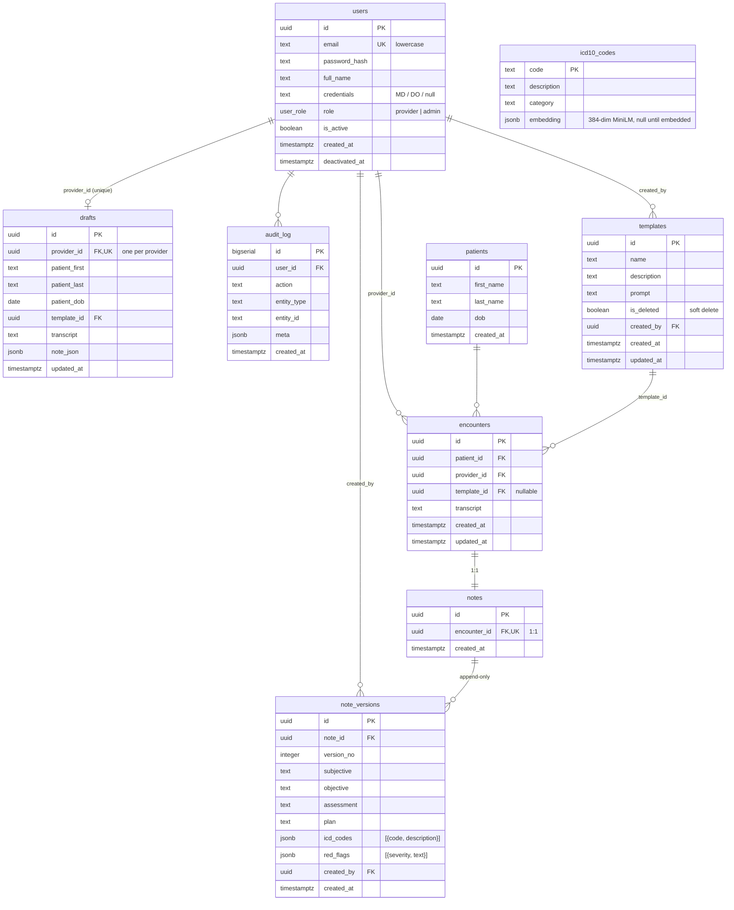

# Kyron Scribe — Entity Relationship Diagram & Schema Rationale

The schema is normalized to 3NF. JSONB is used only for genuinely list-shaped payloads that are
part of an immutable, signed version row (the ICD code list and the red-flag list). All timestamps
are `timestamptz`. Identifiers are `uuid` (`gen_random_uuid()`), except the append-heavy
`audit_log`, which uses `bigserial` because it is a high-volume monotonic log with no external FK
targets that need an opaque id.

Authoritative DDL: [`server/migrations/001_init.sql`](../server/migrations/001_init.sql).

## Diagram

## Per-table commentary

### `users`
Providers and admins in one table, discriminated by the `user_role` enum. `email` is unique and
stored lowercase (the app normalizes on write and on login lookup). `is_active` plus
`deactivated_at` implement soft deactivation: an admin flips `is_active` to `false`, and because the
auth middleware re-reads this row on **every** protected request, the change is enforced on the
provider's very next API call — the mechanism behind non-happy-path N3. Passwords are bcrypt hashes
(cost 12); the plaintext never touches the database.

### `patients`
Deliberately thin — demo data only, no PHI program. Patient identity is the triple
`(first_name, last_name, dob)`, enforced case-insensitively by
`patients_identity_uidx ON (lower(first_name), lower(last_name), dob)`. This single index does
double duty: it prevents duplicate patient rows on encounter finalize (the app upserts on this
triple) and it powers the returning-patient lookup that decides whether the AI is offered the
patient-history tool.

### `templates`
Admin-authored prompt fragments appended to the base scribe system prompt. `is_deleted` is a **soft
delete**: encounters keep a `template_id` FK for the historical record, so a template can never be
hard-deleted out from under a saved encounter. There is intentionally **no cache** anywhere in the
stack — generation reads the live template row at request time, which is exactly what makes an admin
edit take effect on the provider's next generation with no page refresh (a graded requirement).

### `encounters`
The visit event: who saw whom, with what transcript, under which template. It is intentionally *not*
where clinical note content lives — that is delegated to the version chain, so `encounters` stays a
stable record of the event itself.

### `notes`
A 1:1 anchor for an encounter's version chain (`encounter_id` is `UNIQUE`). It carries no clinical
content of its own. Anchoring versions to a dedicated `notes` row — rather than hanging them off
`encounters` — gives the append-only chain a stable parent and keeps the "visit" and the "document"
as separate concerns.

### `note_versions`
The immutable clinical record: **append-only, never updated or deleted**. Each save inserts a new
row with `version_no = max + 1` for that note. `UNIQUE (note_id, version_no)` makes concurrent saves
race-safe: two writers computing the same next number will collide on the unique constraint, and the
loser retries with the new max. `created_by` + `created_at` give the full "who saved what, when"
audit trail the challenge requires. `icd_codes` and `red_flags` are JSONB **on the version** because
they are part of the signed historical artifact — the exact codes attached at the moment of signing,
not a live join to the mutable catalog.

### `drafts`
Mutable scratch state for one in-flight encounter, one row per provider
(`provider_id` is `UNIQUE`). Kept in its own table so the immutable clinical record never mixes with
autosaved work-in-progress. Because it is DB-backed and keyed on the provider, a draft survives a
refresh and restores on any device after re-login (session persistence, and the preserved-draft half
of N3). `note_json` holds a generated-but-unsaved note including inline edits.

### `icd10_codes`
The normalized search catalog: ~300+ ICD-10-CM entries. `embedding` is a JSONB array holding the
384-dimensional MiniLM vector, `null` until the seed's `--embed` step computes it. At 300 codes an
approximate-nearest-neighbor index is overkill, so search loads the vectors into memory once at boot
and does exact cosine in-process (microseconds), with an `ILIKE` keyword fallback. This is the
normalized catalog; the *selected* codes are copied as JSONB onto the note version at save time.

### `audit_log`
Append-only event log for auth, clinical, and admin mutations. `bigserial` id because it is
write-heavy and never referenced by FK. `meta` JSONB carries per-action context. `user_id` is
nullable so pre-auth or system events can still be recorded.

## Index rationale

Every index maps to a named query path — none are speculative:

| Index | Query path it serves |
|---|---|
| `users_email` (from `UNIQUE`) | Login lookup by normalized email. |
| `patients_identity_uidx` | Returning-patient lookup + duplicate-prevention on encounter finalize. |
| `encounters_provider_created_idx (provider_id, created_at DESC)` | Provider's "My Encounters" list and the admin provider filter, already sorted newest-first. |
| `encounters_patient_idx (patient_id)` | The `get_patient_history` tool's retrieval of a patient's prior encounters. |
| `encounters_created_idx (created_at DESC)` | Admin date-range filter across all providers. |
| `notes_encounter (from UNIQUE)` | Resolve an encounter's note anchor. |
| `note_versions (note_id, version_no) UNIQUE` | Race-safe next-version insert; also the natural key. |
| `note_versions_note_idx (note_id, version_no DESC)` | Fetch full version history / latest version, newest-first. |
| `drafts_provider (from UNIQUE)` | Load/upsert the caller's single draft. |
| `icd10_codes` PK on `code` | Direct code upsert during seed and code resolution. |
| `audit_log_created_idx (created_at DESC)` | Recent-activity audit views. |
| `audit_log_user_idx (user_id, created_at DESC)` | Per-user audit trail. |

## Defensibility talking points (for the code walkthrough)

- **Why a separate `notes` table instead of hanging versions off `encounters`?** It gives the
  version chain one stable anchor and keeps two different ideas apart: `encounters` records *the
  visit* (transcript, provider, template), while `note_versions` records *the document's evolution*.
  Mixing them would either denormalize the visit or force nullable clinical columns onto the event
  row.

- **Why is versioning append-only with `UNIQUE (note_id, version_no)`?** The requirement is that a
  prior version is never overwritten or deleted. Modeling each save as an insert makes that
  structurally guaranteed rather than a matter of discipline, and the unique constraint turns the
  "next version number" into a race-safe operation: the database, not application locking, arbitrates
  concurrent saves — the loser simply recomputes `max+1` and retries once.

- **Why are `drafts` a separate table and a per-provider singleton?** Drafts are mutable, disposable
  scratch state; the clinical record is immutable and permanent. Keeping them apart means autosave
  churn never touches signed notes, and the `UNIQUE(provider_id)` constraint models exactly one
  in-flight encounter per provider — which is what makes cross-device restore a single indexed
  lookup.

- **Why does the ICD list live as JSONB on the version, while `icd10_codes` is a normalized table?**
  Two different roles. `icd10_codes` is a *search catalog* you query and embed. The codes attached to
  a note are part of a *signed historical artifact* — you want the exact `{code, description}` pairs
  as they were at signing, frozen on the version, not a live join that could drift if a catalog
  description were later corrected. JSONB captures that list shape without a junction table that would
  add nothing but joins.

- **Why per-request `is_active` re-check instead of trusting the JWT?** The token is stateless and
  valid until expiry; a pure-JWT design cannot revoke a session mid-flight. One indexed primary-key
  lookup per request buys instant deactivation — the difference between "the provider is locked out
  on their next click" and "the provider keeps working until their token expires hours later." That
  is a deliberate, cheap trade, and it is the backbone of scenario N3.

- **Why soft-delete templates?** Encounters reference the template they were generated under. A hard
  delete would orphan that FK or force a cascade that erases history. `is_deleted` hides a template
  from the selector while preserving referential integrity for every past encounter.
